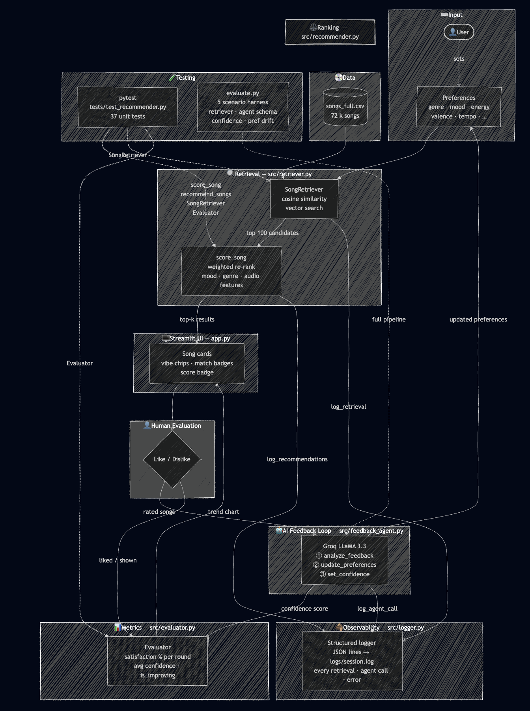
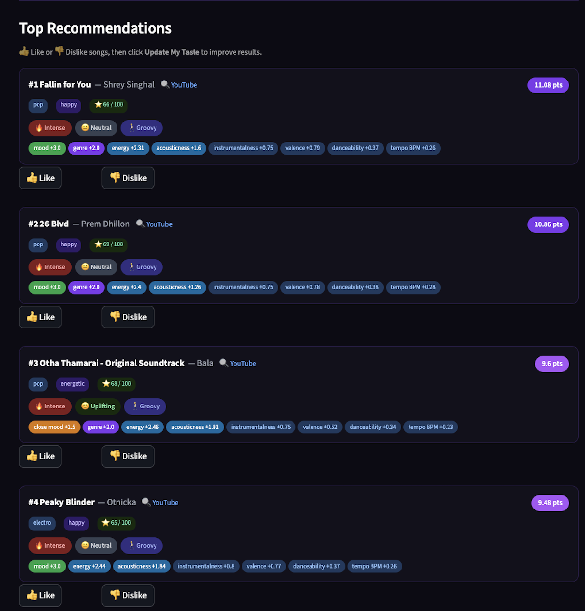
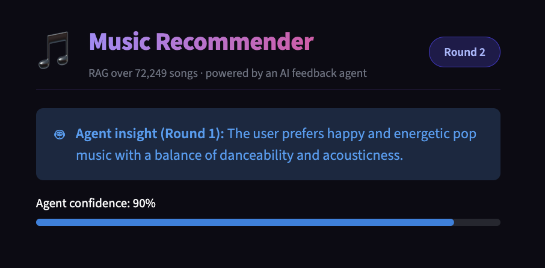
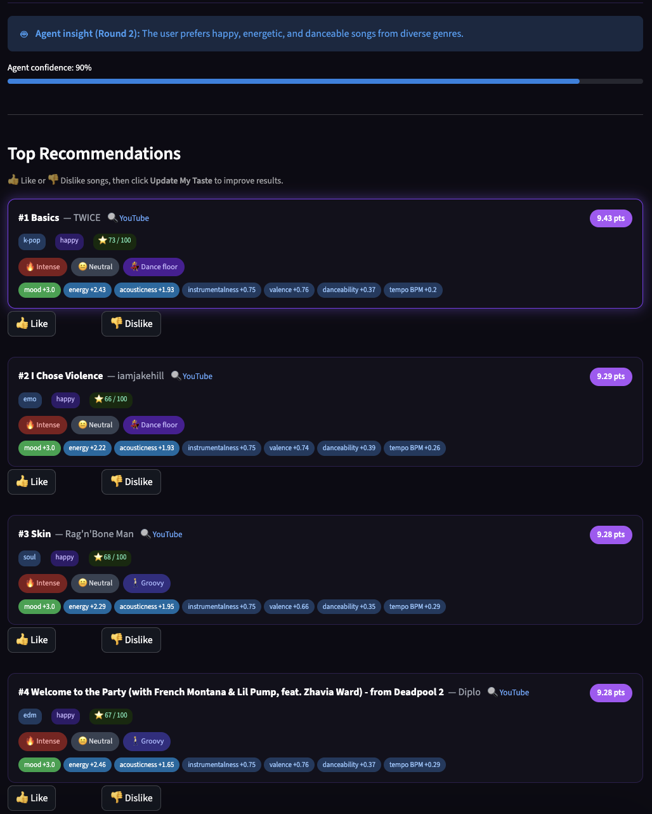
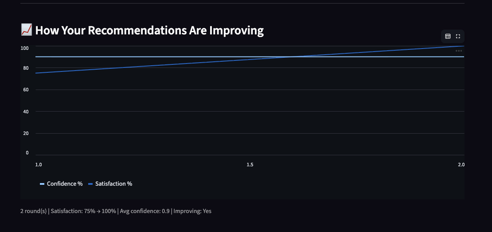

# Music Recommender with AI Feedback Loop

A song recommendation system built on a RAG pipeline and an LLM feedback agent. You set a preference profile, rate the results, and the system adjusts your preferences round-by-round using Groq's LLaMA 3.3. With each round, the recommendations get noticeably different from previous rounds and measurably better.

---

## Base project

This started as a simple 20-song catalog with a single scoring function and a command-line interface. You typed in a preference profile, it scored every song, and printed the top 5. No retrieval, no AI, no feedback loop.

From that base, it was extended into what it is now: a 72k-song catalog with vector search retrieval, an LLM feedback agent that updates your preferences between rounds, a Streamlit web UI, structured logging, and a built-in evaluator that tracks whether the recommendations are actually improving.

---

## Architecture



**Retrieval** (`src/retriever.py`) — Encodes user preferences as a feature vector and runs cosine similarity search over the full catalog with NumPy. Returns the top 100 candidates.

**Ranking** (`src/recommender.py`) — Scores each candidate: mood (up to +3.0 pts), genre (+2.0 pts), and six numeric audio features weighted by how much each one matters to the listening experience.

**AI Feedback Agent** (`src/feedback_agent.py`) — Calls Groq's LLaMA 3.3 70B via structured tool use. Three sequential calls: `analyze_feedback` → `update_preferences` → `set_confidence`. The model edits the preference vector directly and explains its reasoning.

**Evaluator** (`src/evaluator.py`) — Tracks satisfaction % (liked / shown) and agent confidence per round. After two rounds you can see the trend line.

**Logging** (`src/logger.py`) — Every retrieval, agent call, and recommendation set is written to `logs/session.log` as JSON lines.

---

## Real Session Walkthrough

This is a session I ran to verify the feedback loop actually works — profile: pop, happy, high energy.

### Round 1 — Initial recommendations



Top results: Fallin for You (11.08 pts), 26 Blvd (10.86 pts), Otha Thamarai (9.6 pts), Peaky Blinder (9.48 pts). After rating these, the agent analyzed the pattern:

### Agent feedback after Round 1



> "The user prefers happy and energetic pop music with a balance of danceability and acousticness."

Confidence: **90%**. The agent updated the preference sliders accordingly, valence pulled down, acousticness adjusted and the next retrieval ran against the revised profile.

### Round 3 — After the agent updated preferences



The results shifted to a broader genre mix while keeping the happy + energetic core. The agent's Round 2 insight is visible at the top: "The user prefers happy, energetic, and danceable songs from diverse genres."

### Evaluator — tracking improvement over rounds



Satisfaction went from 75% to 100%. Avg confidence: 0.9. The system confirmed: **Improving: Yes**.

---

## Design Decisions

**Why RAG instead of scoring every song?**
72k songs × full scoring per query works fine on a laptop. But the point of this project was to build something that could actually scale. Vector search is fast and the cosine similarity space is close enough to the scoring weights that the top 100 candidates almost always contain the real top 5 for numeric-heavy profiles. The one caveat: the retriever doesn't use mood or genre, so a song with a perfect mood match but average audio features could rank outside the top 100 and never reach the scoring step.

**Why LLM tool use instead of averaging liked song features?**
I tried the averaging approach first. It works but it's too blunt, if you like a song for its energy and dislike a different song for its energy, averaging cancels both signals. The LLM reads the pattern across multiple ratings and makes a judgment. It's harder to get wrong in subtle ways, and it explains what it changed and why.

**Mood is weighted highest (3.0 pts), genre second (2.0 pts)**
Genre tells you what someone usually listens to. Mood tells you why they're listening right now. A rock fan who's in a chill mood doesn't want Metallica. Without mood scoring, nothing prevents genre-mismatched songs from ranking high on numeric features alone. A classical track with low energy and high acousticness would score well for a lofi profile even though it doesn't belong there. Mood is load-bearing.

**Tempo normalization**
Tempo is in BPM (60–180+), while every other feature is 0–1. Before I normalized it, songs with tempo outside the expected range produced negative scores. I caught this with a test that feeds a 250 BPM song and asserts the score is ≥ 0. The fix was clamping: `pts = max(0.0, max_pts * (1 - abs(song_val - user_val)))`.

---

## Testing

**37 unit tests** across 4 classes in `tests/test_recommender.py`:

| Class | Tests | What it covers |
|---|---|---|
| `TestScoreSong` | 11 | Scoring logic, mood adjacency, boundary values |
| `TestRecommendSongs` | 7 | Filtering liked IDs, sort order, k parameter |
| `TestSongRetriever` | 8 | Vector retrieval, exclusion, edge cases |
| `TestEvaluator` | 11 | Satisfaction tracking, confidence, improving flag |

The test I'm most glad I wrote: `test_score_is_never_negative`. It feeds a song with tempo=250 BPM (outside the normalized range) and checks the score doesn't go below 0. That test caught the actual bug before I'd even understood the root cause.

`tests/evaluate.py` is a 5-scenario integration harness that runs the full pipeline end-to-end — retrieval → agent → evaluator — and validates schema, confidence bounds, and that preference drift goes in the right direction.

```bash
pytest          # 37 passed in 0.38s
```

---

## Limitations

- The catalog is 72k songs but only covers what's in the dataset. Niche tastes get approximations, not real matches.
- The agent updates preferences every round regardless of confidence level. At 50% confidence it probably shouldn't be editing the valence slider.
- Liked song IDs aren't persisted across page refreshes. Reload and you start from scratch.
- Tempo barely affects the score (max 0.3 pts). If BPM matters to you, the system mostly ignores it.

---

## Setup

```bash
# 1. Clone and create a virtualenv
python -m venv .venv
source .venv/bin/activate       # Mac / Linux
.venv\Scripts\activate          # Windows

# 2. Install dependencies
pip install -r requirements.txt

# 3. Set your Groq API key (free at console.groq.com)
cp .env.example .env
# open .env and paste your key

# 4. Run the app
streamlit run app.py

# 5. Run tests
pytest
```

---

## What I'd do differently

The hardest part wasn't the recommendation logic, it was the feedback loop state. Session state in Streamlit resets on reload, liked song IDs weren't accumulating between rounds, and the evaluator's improving flag needs at least two rounds of history to mean anything. Getting all three consistent took more debugging than the scoring function did.

If I were extending this: persist session state to SQLite so history survives a reload, let the agent surface its reasoning in the UI (right now it updates the sliders but doesn't explain what it changed), and replace the hand-tuned scoring weights with a learned ranker once there's enough rating history to train on.

The feedback loop working at all was the part that surprised me. I expected the LLM to hallucinate invalid preference values or drift randomly. Instead, the reasoning was coherent and the scores improved measurably. That result is what made this worth building.
